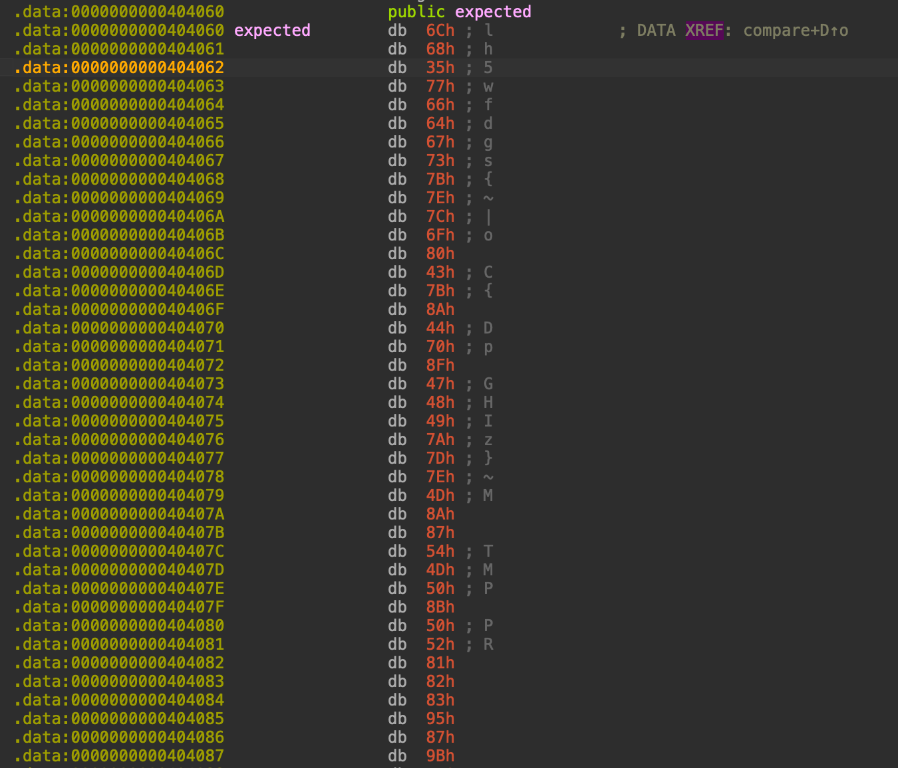
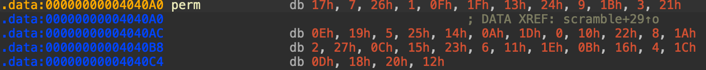

# Olicyber Nazionale 2026 – Binary 1 – Ultima Parola

## Challenge Overview

This was a reverse engineering challenge that required analyzing a binary to retrieve the flag. The program accepts user input, performs a series of transformations on it, and compares the result against a hardcoded array of expected values. The challenge involved understanding the execution flow triggered by `atexit()` handlers and reversing the transformations to recover the flag.

---

## Binary Analysis

### Program Entry Point

The `main()` function presents a simple interface:

```c
int __fastcall main(int argc, const char **argv, const char **envp)
{
  printf(format: "Inserisci la password: ");
  fgets(s: input_buf, n: 256, stream: stdin);
  input_buf[strcspn(s: input_buf, reject: "\n")] = 0;
  if ( strlen(s: input_buf) == 40 )
  {
    atexit(epilogo);
    atexit(compare);
    atexit(twist);
    atexit(scramble);
    puts(s: "Elaborazione completata.");
    return 0;
  }
  else
  {
    puts(s: "Lunghezza errata.");
    return 1;
  }
}
```

Key observations:
- The password must be exactly 40 characters long.
- `atexit()` functions execute in **reverse order of registration** (LIFO - Last In, First Out).

### Execution Flow

The `atexit()` registration order:
1. `epilogo` (rexecutes last)
2. `compare` (executes third)
3. `twist` (executes second)
4. `scramble` (executes first)

So the actual execution order upon program exit is:
```
scramble() → twist() → compare() → epilogo()
```

---

## Function Analysis

### 1. `scramble()` - Permutation

```c
unsigned __int64 __fastcall scramble()
{
  int i; // [rsp+Ch] [rbp-34h]
  _QWORD v2[5]; // [rsp+10h] [rbp-30h]
  unsigned __int64 v3; // [rsp+38h] [rbp-8h]

  v3 = __readfsqword(0x28u);
  for ( i = 0; i <= 39; ++i )
    *((_BYTE *)v2 + perm[i]) = input_buf[i];
  *(_QWORD *)input_buf = v2[0];
  qword_404108 = v2[1];
  qword_404110 = v2[2];
  qword_404118 = v2[3];
  qword_404120 = v2[4];
  return v3 - __readfsqword(0x28u);
}
```

This function performs a permutation of the input buffer using a hardcoded mapping array `perm[]`. Each byte `input_buf[i]` is placed at position `perm[i]` in a temporary buffer, which is then copied back to `input_buf`.

### 2. `twist()` - Additive Transformation

```c
__int64 __fastcall twist()
{
  __int64 i_1; // rax
  int i; // [rsp+0h] [rbp-4h]

  for ( i = 0; i <= 39; ++i )
  {
    i_1 = i;
    input_buf[i] += i;
  }
  return i_1;
}
```

This function simply adds the index `i` to each character in the buffer.

### 3. `compare()` - Verification

```c
int __fastcall compare()
{
  int result; // eax

  result = memcmp(s1: input_buf, s2: &expected, n: 0x28u);
  if ( result )
    status = 1;
  return result;
}
```

Compares the transformed input against a hardcoded 40-byte array `expected[]`.

### 4. `epilogo()` - Result Display

```c
int __fastcall epilogo()
{
  if ( status )
    return puts(s: "Non e' questa la parola segreta...");
  else
    return puts(s: "Complimenti! Hai trovato la parola segreta!");
}
```

Displays success/failure message based on the `status` flag.

---

## Hardcoded Data

### Expected Array

The `expected[]` array contains the final transformed values that the input must match after both `scramble()` and `twist()` transformations:



### Prem Array

The `perm[]` array defines how characters are shuffled during the `scramble()` function:



---

## Reversing the Transformations

To recover the flag, we need to work backwards from the `expected[]` array, applying inverse operations in reverse order of the original transformations.

### Step 1: Reverse `twist()`

`twist()` performs: `output[i] = input[i] + i`

The inverse is: `input[i] = output[i] - i`

### Step 2: Reverse `scramble()`

`scramble()` performs: `output[perm[i]] = input[i]`

The inverse requires finding where each original character ended up. If `output[perm[i]] = input[i]`, then:
- Original position `i` moved to `perm[i]`
- To reverse: the character at position `perm[i]` goes back to position `i`

This means we need to **inverse the permutation**: for each index `j` in the permuted array, find which `i` satisfies `perm[i] = j`.

### The Exploit Code

```python
# Hardcoded expected array after both transformations
expected = [0x6c, 0x68, 0x35, 0x77, 0x66, 0x64, 0x67, 0x73, 0x7b, 0x7e, 
            0x7c, 0x6f, 0x80, 0x43, 0x7b, 0x8a, 0x44, 0x70, 0x8f, 0x47, 
            0x48, 0x49, 0x7a, 0x7d, 0x7e, 0x4d, 0x8a, 0x87, 0x54, 0x4d, 
            0x50, 0x8b, 0x50, 0x52, 0x81, 0x82, 0x83, 0x95, 0x87, 0x9b]

# Permutation mapping used by scramble()
perm = [0x17, 0x07, 0x26, 0x01, 0x0f, 0x1f, 0x13, 0x24, 0x09, 0x1b, 
        0x03, 0x21, 0x0e, 0x19, 0x05, 0x25, 0x14, 0x0a, 0x1d, 0x00, 
        0x10, 0x22, 0x08, 0x1a, 0x02, 0x27, 0x0c, 0x15, 0x23, 0x06, 
        0x11, 0x1e, 0x0b, 0x16, 0x04, 0x1c, 0x0d, 0x18, 0x20, 0x12]

# Step 1: Reverse the additive transformation
for i in range(len(expected)):
    expected[i] = expected[i] - i

# Step 2: Reverse the permutation
array = [0] * 40
for i in range(len(expected)):
    array[i] = expected[perm[i]]

# Output the flag
print(''.join(chr(c) for c in array))
```